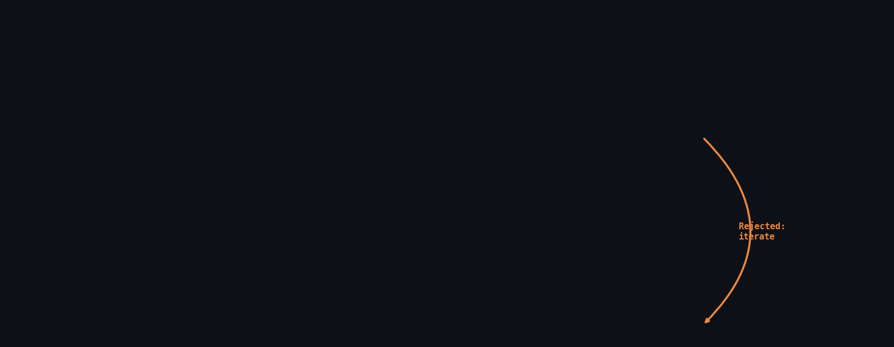
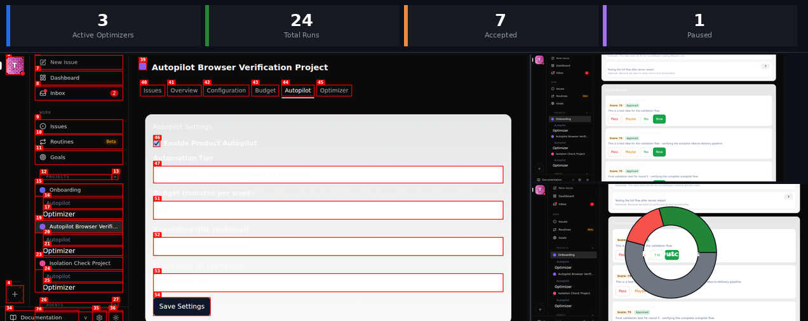

# Product Autopilot

<!-- HERO IMAGE -->
<!-- Place hero.png here: a dark terminal-style screenshot showing an active optimization run with score deltas, or an animated loop diagram -->



Product Autopilot improves your codebase automatically — testing candidate changes against a fixed evaluator and keeping only strict wins.

[](#) [](#) [](#) [](#)

---

## The problem it solves

Engineering teams leave improvement gains on the table every day — uneven code quality, ad-hoc linters that nobody maintains, and follow-through that never happens. Product Autopilot makes code improvement autonomous, measurable, and safe enough to trust on real teams.

## How it works

```
Define Surface   →   Run Candidates   →   Accept Improvements
   (mutator)         (scorer)            (human or auto)
```

1. **Define what to improve** — point the mutator at a specific surface (files, modules, test suites)
2. **Explore candidates** — let the evaluator test each mutation independently
3. **Keep only strict wins** — accept improvements only when the score delta is real, not noise

## Key features

- **Score-improvement policies** — threshold, confidence, or epsilon-based — so noisy scorers can't fool the system
- **Git-worktree sandboxes** — every candidate runs in a clean, isolated copy of the workspace
- **Manual approval gates** — human review before any change touches production code
- **Delivery runs** — track every accepted change with full diff, score, and guardrail output
- **Optional PR generation** — turns accepted runs into GitHub PRs automatically
- **Rich metrics dashboard** — score history, delta trends, run outcomes, and stagnation alerts

<!-- DASHBOARD IMAGE -->
<!-- Place dashboard.png here: the Autopilot overview widget showing active optimizers, run counts, and score history -->



## Getting started

1. Install the Product Autopilot plugin from the Paperclip plugin manager
2. Create an optimizer: choose a surface to improve and define your scorer
3. Launch a run and review accepted candidates in the Autopilot tab

Ship the gains with confidence — or let Autopilot run autonomously in the background.

## Built-in templates

Not sure where to start? Pick a template:

| Template | Mode | Best for |
|---|:---:|---|
| **Test Suite Ratchet** | Manual approval | Code quality, test stability |
| **Lighthouse Candidate** | Manual approval | Frontend performance |
| **Dry Run Prototype** | Dry run | Proposal generation |
| **Noisy Scorer Ratchet** | Manual approval | Sampled metrics, Lighthouse scores |
| **Epsilon Stability** | Automatic | Latency, known minimum thresholds |
| **Stagnation Guard** | Automatic | Auto-pause on consecutive non-improvements |

---

*Product Autopilot is a [Paperclip](https://paperclip.ai) plugin.*
